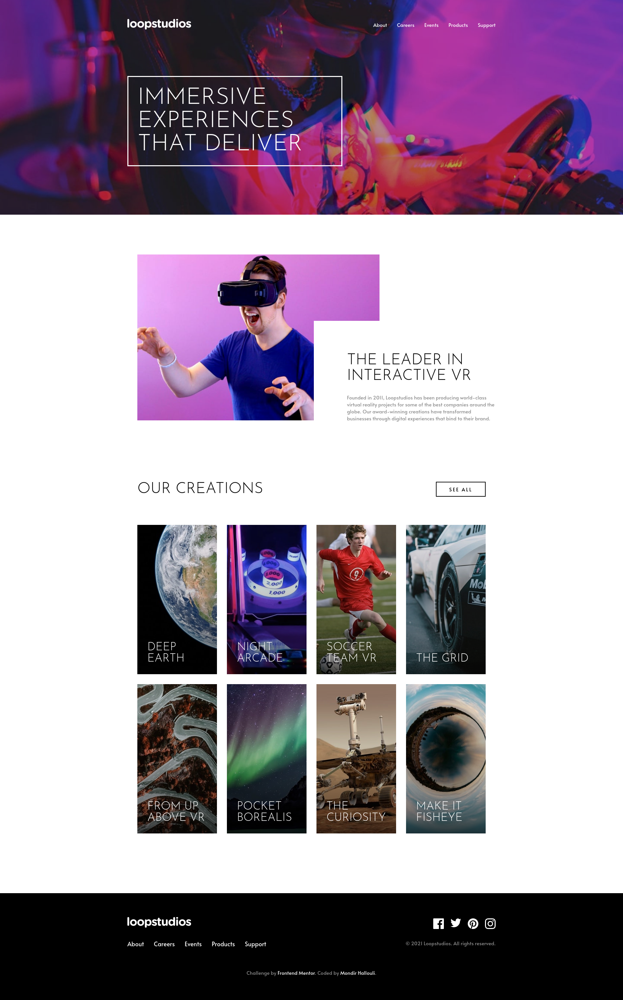

# Frontend Mentor - Loopstudios landing page solution

This is a solution to the [Loopstudios landing page challenge on Frontend Mentor](https://www.frontendmentor.io/challenges/loopstudios-landing-page-N88J5Onjw). Frontend Mentor challenges help you improve your coding skills by building realistic projects. 

## Table of contents

- [Overview](#overview)
  - [The challenge](#the-challenge)
  - [Screenshot](#screenshot)
  - [Links](#links)
- [My process](#my-process)
  - [Built with](#built-with)
  - [What I learned](#what-i-learned)
  - [Useful resources](#useful-resources)
- [Author](#author)

## Overview

### The challenge

Users should be able to:

- View the optimal layout for the site depending on their device's screen size
- See hover states for all interactive elements on the page

### Screenshot

### Links

- Solution: [here](https://www.github.com/)
- Live Site: [here](https://your-live-site-url.com)

## My process

### Built with

- Semantic HTML5 markup
- Flexbox
- CSS Grid
- Mobile-first workflow
- [React](https://reactjs.org/) - JS library
- [SASS/SCSS](https://sass-lang.com/) - For styles

### What I learned

My maine focus here is to create a responsive one page website, the challenge was to structure the project in a way that would feel natural and easy to change in the future. The hardest part was the mobile menu, which I had to experiment with a few things to get right.

### Useful resources

- [SASS Docs](https://www.sass-lang.com/documentation) - This helped me with sass mixins and functions.
- [MDN Docs](https://www.mdn.net) - This was a great resource for miscellanious things like specific css props and JS functions.

## Author

- Website - [Portfolio](https://www.mh-portfolio.pages.dev)
- Frontend Mentor - [@mondirhallouli](https://www.frontendmentor.io/profile/mondirhallouli)
- Github - [@mondirhallouli](https://www.github.com/mondirhallouli)